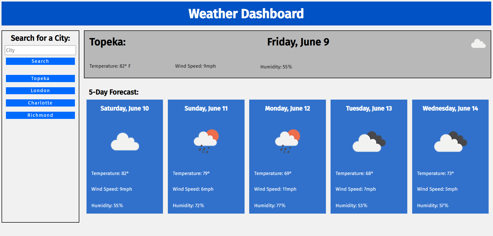

# Weather Dashboard

## Description
I created this application to show my knowledge of server-side API's and my ability to use them to display dynamix data. This app was made using HTML, CSS, Javascript, along with secondary libraries including dayjs, and jquery. This Weather Dashboard allows you to search for a city, to see that cities current weather, and to also see a five day forecast for that city.

## Table of Contents
* [Installation](#installation)
* [Usage](#usage)
* [License](#license)
* [Contributing](#contributing)
* [Tests](#tests)
* [Questions](#questions)

## Installation
This application cannot be intalled locally but instead can be viewed at [this link here](https://blakee-37.github.io/Weather-Dashboard).

## Usage
To use this application, simply type a city in the text box located on the left side of the screen, and press the search button. The weather data for that city will then be displayed onto the screen. You may also press the button that was added to the city history to view that cities weather again.

## License
none

## Contributing
No contributions are available for this project.

## Tests
No tests are available for this project.

## Questions
[My Github Profile](https://github.com/BlakeE-37)  
For Questions, you can email me at [hollibe2000@gmail.com](mailto:hollibe2000@gmail.com)